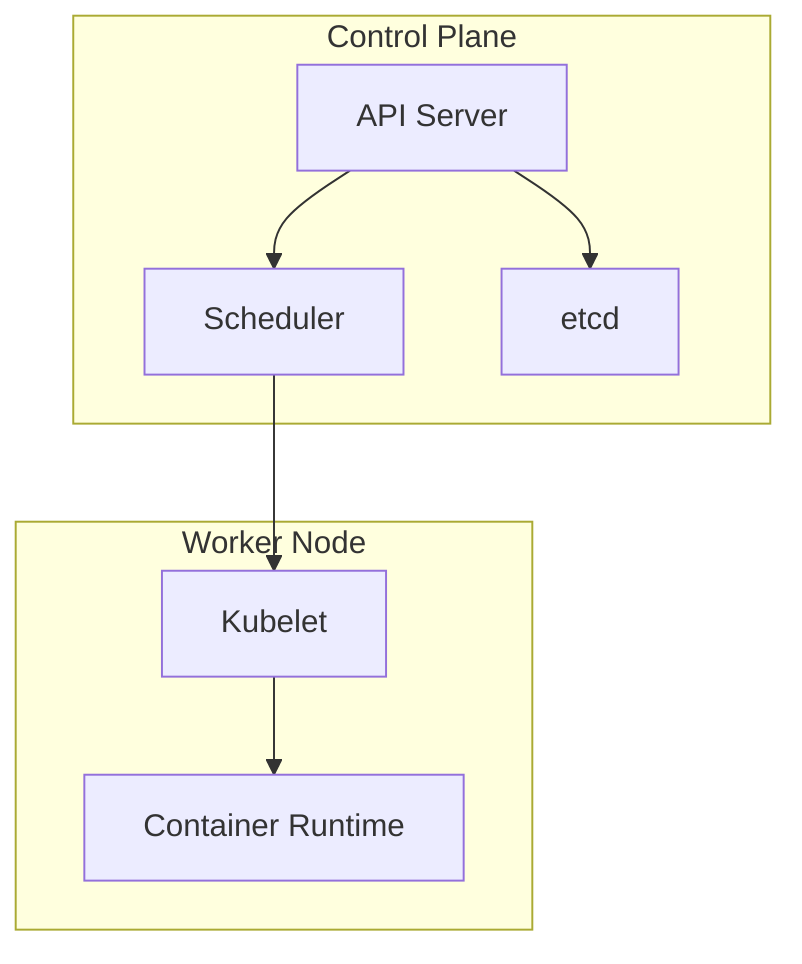
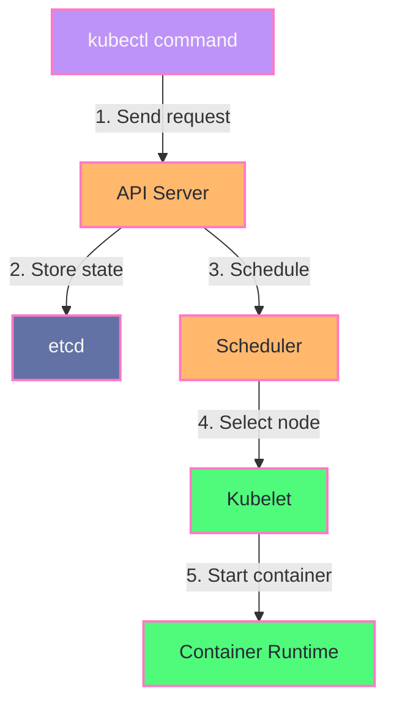
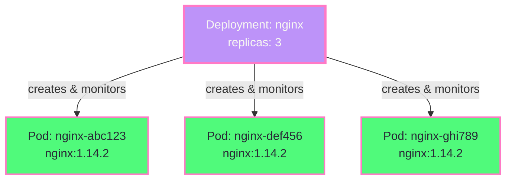
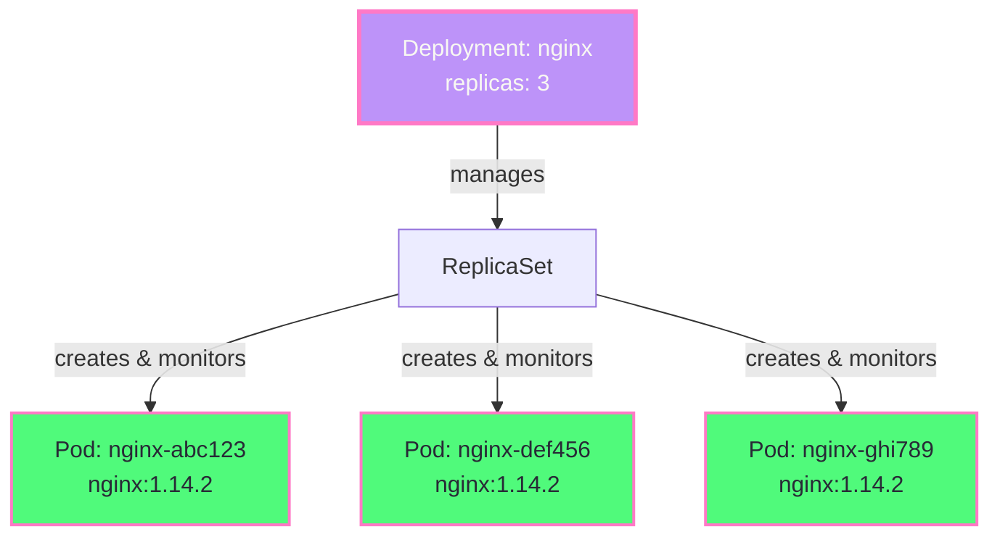

---
# try also 'default' to start simple
theme: dracula
# some information about your slides (markdown enabled)
title: Kubernetes 101
info: Codefreeze Kubernetes 101

class: text-center
# https://sli.dev/features/drawing
drawings:
  persist: false
# slide transition: https://sli.dev/guide/animations.html#slide-transitions
transition: slide-left
---

# Kubernetes 101

A practical Kubernetes

---

# What are we going to cover today?

- Kubernetes Fundamentals
- Pods & Deployments
- Networking
- Kubernetes Primitives

---

# Kubernetes Architecture

<div style="text-align: center;">



</div>

---

# Pod

```yaml [pod.yaml]
apiVersion: v1
kind: Pod
metadata:
  name: nginx
spec:
  containers:
    - name: nginx
      image: nginx:1.14.2
      ports:
        - containerPort: 80
```

```shell
kubectl apply -f pod.yaml
```

---

# Component Communication

<div style="text-align: center;">



</div>

---

# Pods

```yaml [pod.yaml] {all|1-2|3-4|5-10|all} twoslash
apiVersion: v1
kind: Pod
metadata:
  name: nginx
spec:
  containers:
    - name: nginx
      image: nginx:1.14.2
      ports:
        - containerPort: 80
```

<div v-click>

This is equivalent to:

```shell
docker run -d -p 8080:80 nginx:1.14.2
```

</div>

---

# Deployment

````md magic-move {lines: true}
```yaml [deployment.yaml] {all|1-2|3-6|7-11|12-21}
apiVersion: apps/v1
kind: Deployment
metadata:
  name: nginx-deployment
  labels:
    app: nginx
spec:
  replicas: 3
  selector:
    matchLabels:
      app: nginx
  template:
    metadata:
      labels:
        app: nginx
    spec:
      containers:
        - name: nginx
          image: nginx:1.14.2
          ports:
            - containerPort: 80
```

```yaml [pod.yaml] {3-13}
apiVersion: v1
kind: Pod
metadata:
  name: nginx
  labels:
    app: nginx
spec:
  containers:
    - name: nginx
      image: nginx:1.14.2
      ports:
        - containerPort: 80
```
````

---

# Deployments and Pods

<div style="text-align: center;">



</div>

---

# Deployments and Pods

(The more technically accurate version)

<div style="text-align: center;">



</div>

---

# Reaching the Pods

### Why we need a networking abstraction

Pods are ephemeral! Their IPs can change anytime.

```shell
kubectl get pods -l app=nginx -o jsonpath='{.items[*].status.podIP}'
kubectl rollout restart deployment/nginx-deployment
kubectl get pods -l app=nginx -o jsonpath='{.items[*].status.podIP}'  # different now!
```

---

# Services

<div style="text-align: center;">

```mermaid {scale: 0.8, alt: 'Service providing stable endpoint to ephemeral Pods'}
graph TD
    F[Frontend<br/>Needs to connect to Backend]

    subgraph Backend["Backend Pods (Ephemeral)"]
        P1[Pod: nginx-abc123<br/>IP: 10.0.1.1<br/>✓ Healthy]
        P2[Pod: nginx-def456<br/>IP: 10.0.1.2<br/>✗ UNHEALTHY]
        P3[Pod: nginx-ghi789<br/>IP: 10.0.1.3<br/>✓ Healthy]
        P4[Pod: nginx-jkl012<br/>IP: 10.0.1.4<br/>🔄 Creating...]
    end

    F -.->|"Where to route traffic?"| P1
    F -.->|"Where to route traffic?"| P2
    F -.->|"Where to route traffic?"| P3
    F -.->|"Where to route traffic?"| P4


    style P1 fill:#50fa7b,stroke:#ff79c6,stroke-width:2px,color:#282a36
    style P2 fill:#ff5555,stroke:#ff79c6,stroke-width:2px,color:#f8f8f2
    style P3 fill:#50fa7b,stroke:#ff79c6,stroke-width:2px,color:#282a36
    style P4 fill:#8be9fd,stroke:#ff79c6,stroke-width:2px,color:#282a36
```

</div>

---

<div style="text-align: center;">

```mermaid {scale: 0.9, alt: 'Service providing stable endpoint to ephemeral Pods'}
graph TB
    subgraph Backend["Backend Pods (Ephemeral)"]
        P1[Pod: nginx-abc123<br/>IP: 10.0.1.1<br/>✓ Healthy]
        P2[Pod: nginx-def456<br/>IP: 10.0.1.2<br/>✗ UNHEALTHY]
        P3[Pod: nginx-ghi789<br/>IP: 10.0.1.3<br/>✓ Healthy]
        P4[Pod: nginx-jkl012<br/>IP: 10.0.1.4<br/>🔄 Creating...]
    end

    F1[Frontend<br/>Needs to connect to Backend]
    SVC[Service<br/><code>backend.cluster.svc</code><br/>Acts as stable endpoint]

    F1 -->|"Always connects to"| SVC
    SVC -->|Routes to healthy Pods| P1
    SVC -->|Does not route to unhealthy Pods| P2
    SVC -->|Routes to healthy Pods| P3
    SVC -->|Does not route to non-ready Pods| P4

    style P1 fill:#50fa7b,stroke:#ff79c6,stroke-width:2px,color:#282a36
    style P2 fill:#ff5555,stroke:#ff79c6,stroke-width:2px,color:#f8f8f2
    style P3 fill:#50fa7b,stroke:#ff79c6,stroke-width:2px,color:#282a36
    style P4 fill:#8be9fd,stroke:#ff79c6,stroke-width:2px,color:#282a36
    style SVC fill:#8be9fd,stroke:#ff79c6,stroke-width:2px,color:#282a36
```

</div>

---

# Services

```yaml [service.yaml] {all|5-7|8-11} {lines: true}
apiVersion: v1
kind: Service
metadata:
  name: my-service
spec:
  selector:
    app.kubernetes.io/name: nginx
  ports:
    - protocol: TCP
      port: 80
      targetPort: 80
```

---

# Ingress

````md magic-move {lines: true}
```yaml [ingress.yaml] {all|6|7-18} twoslash
apiVersion: networking.k8s.io/v1
kind: Ingress
metadata:
  name: my-service-ingress
spec:
  ingressClassName: alb
  rules:
    - http:
        paths:
          - path: /
            pathType: Prefix
            backend:
              service:
                name: my-service
                port:
                  number: 80
```

```yaml [ingress.yaml]
backend:
  service:
    name: my-service
    port:
      number: 80
```
````

<div v-click>

```yaml [service.yaml]
apiVersion: v1
kind: Service
metadata:
  name: my-service
spec:
  selector:
    app.kubernetes.io/name: nginx
  ports:
    - protocol: TCP
      port: 80
      targetPort: 80
```

</div>

---

# Ingress

<div style="text-align: center;">

```mermaid {scale: 0.8, alt: 'Ingress routing traffic to Service which routes to Pods'}
graph TB
    Ingress[📄 Ingress Resource]
    IC[🎮 Ingress Controller<br/>AWS ALB Controller]
    ALB[⚖️ Application Load Balancer]
    Service[🔗 Service<br/>ClusterIP]
    Pods[📦 Backend Pods]

    IC -->|watches| Ingress
    IC -->|creates & configures| ALB
    ALB -->|routes to| Service
    Service -.->|endpoints| Pods

    style Ingress fill:#bd93f9,stroke:#6272a4,color:#282a36
    style IC fill:#ff79c6,stroke:#6272a4,color:#282a36
    style Service fill:#8be9fd,stroke:#6272a4,color:#282a36
    style ALB fill:#50fa7b,stroke:#6272a4,color:#282a36
    style Pods fill:#f1fa8c,stroke:#6272a4,color:#282a36
```

</div>

---

# Quick Summary

- Pod: Smallest deployable unit, runs one or more containers
- Deployment: Manages Pods, ensures desired state (e.g., number of replicas)
- Service: Stable endpoint to access Pods, handles load balancing
- Ingress: Manages external access to Services, provides routing rules

---

# Jobs

````md magic-move {lines: true}
```yaml [pi.yaml] {all|1-2|3-4|5-12}
apiVersion: batch/v1
kind: Job
metadata:
  name: pi
spec:
  template:
    spec:
      containers:
        - name: pi
          image: perl:5.34.0
          command: ["perl", "-Mbignum=bpi", "-wle", "print bpi(2000)"]
      restartPolicy: Never
  backoffLimit: 4
```

```yaml [pod.yaml] {5-10}
apiVersion: v1
kind: Pod
metadata: ...
spec:
  containers:
    - name: pi
      image: perl:5.34.0
      command: ["perl", "-Mbignum=bpi", "-wle", "print bpi(2000)"]
```
````

---

# Secrets

````md magic-move {lines: true}
```yaml {all|4,6,22-24}{lines: true}
apiVersion: v1
kind: Secret
metadata:
  name: my-secret
data:
  my-secret-string: aHR0cHM6Ly93d3cueW91dHViZS5jb20vd2F0Y2g/dj1kUXc0dzlXZ1hjUQo=
---
apiVersion: v1
kind: Pod
metadata:
  name: my-pod
spec:
  containers:
    - name: my-container
      image: busybox
      command:
        - echo
        - $MY_SECRET
      env:
        - name: MY_SECRET
          valueFrom:
            secretKeyRef:
              name: my-secret
              key: my-secret-string
```

```yaml {19-21}{lines: true}
apiVersion: v1
kind: Secret
metadata:
  name: my-secret
data:
  my-secret-string: aHR0cHM6Ly93d3cueW91dHViZS5jb20vd2F0Y2g/dj1kUXc0dzlXZ1hjUQo=
---
apiVersion: v1
kind: Pod
metadata:
  name: my-pod
spec:
  containers:
    - name: my-container
      image: busybox
      command:
        - echo
        - $MY_SECRET
      envFrom:
        - secretKeyRef:
            name: my-secret
```
````

---

# ConfigMaps

```yaml {all|4,6,22-24}{lines: true}
apiVersion: v1
kind: ConfigMap
metadata:
    name: my-config
data:
    my-config-string: "Hello, Kubernetes!"
```

---

# Custom Resources
